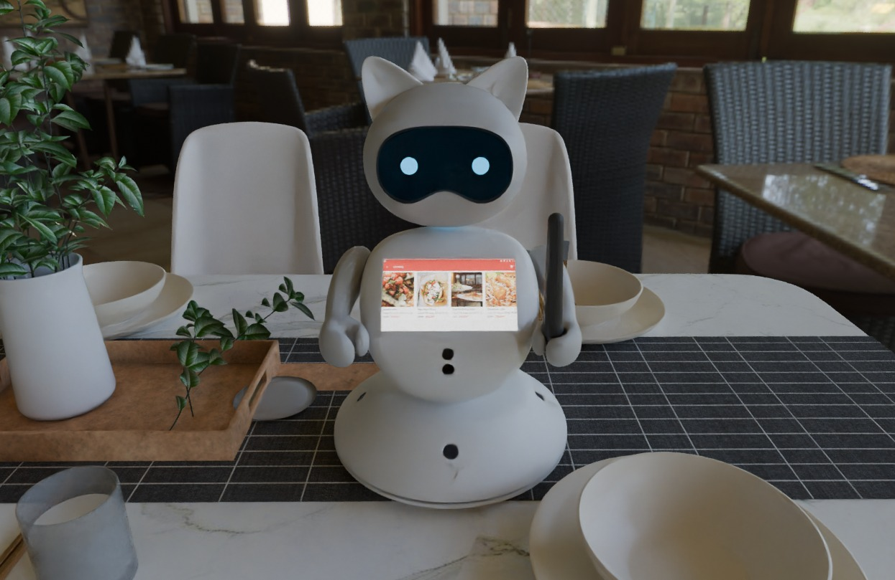
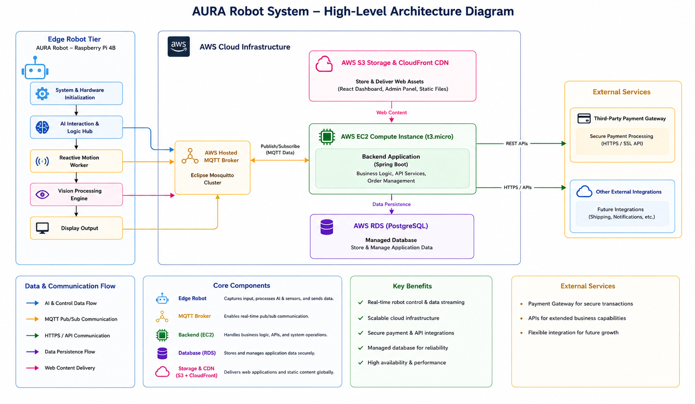
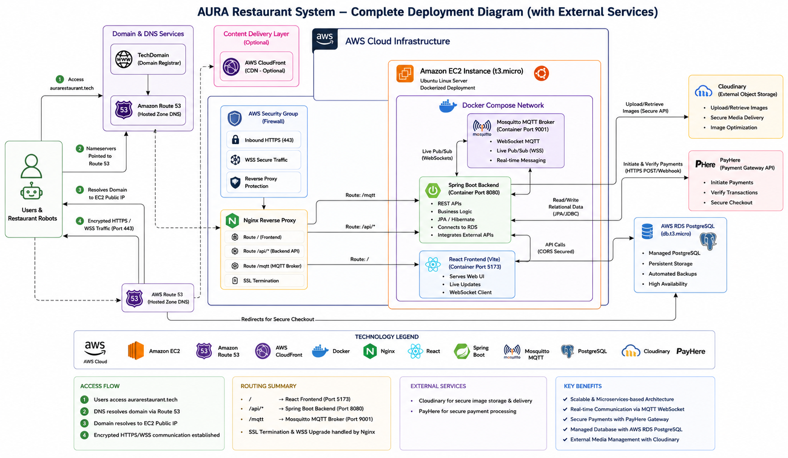
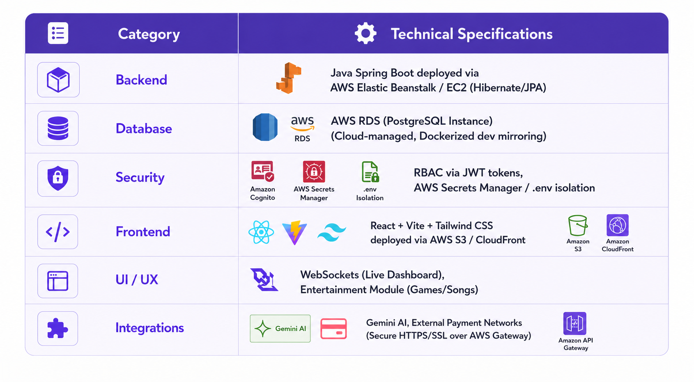
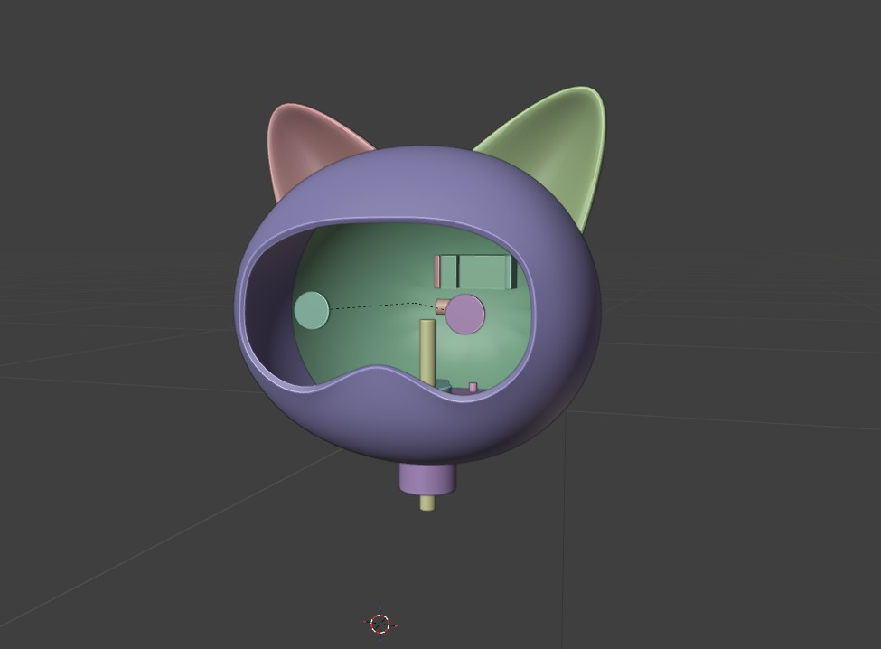
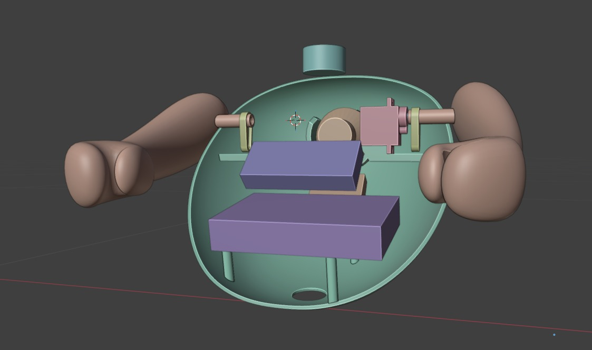
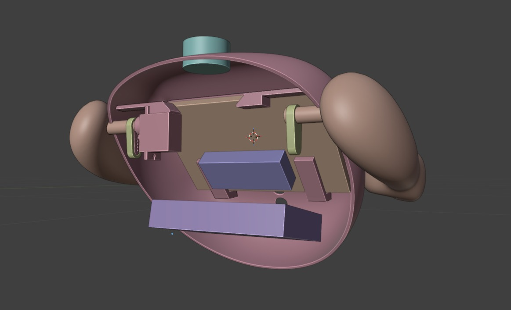
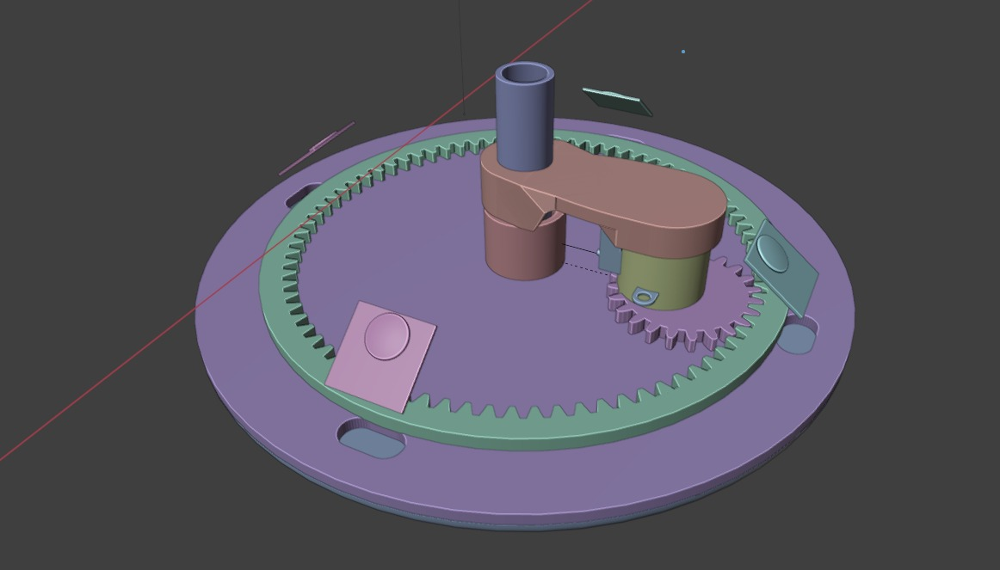

# 🐾 AURA — Automated Urban Restaurant Assistant

### *The dining companion that turns to face you.*

A socially-aware, table-top robot that greets guests, tracks faces, takes orders, processes payments, and entertains — all without a single wire on the table.

---

## 📑 Table of Contents

1. [Introduction](#-introduction)
2. [Meet AURA — Key Features](#-meet-aura--key-features)
3. [Solution Architecture](#-solution-architecture)
4. [Hardware & Software Design](#-hardware--software-design)
5. [Chassis Design (CAD / Blender Model)](#-chassis-design-cad--blender-model)
6. [Data Flow](#-data-flow)
7. [Testing](#-testing)
8. [Team](#-team)
9. [Links](#-links)

---

## 🌟 Introduction

In the modern hospitality industry, customers often face delays in ordering, difficulties communicating with staff due to language barriers, and a lack of engaging entertainment while waiting. **AURA (Automated Urban Restaurant Assistant)** addresses these issues by introducing a smart, interactive table-top robot companion.

Unlike standard digital kiosks, AURA applies **Social Robotics** principles — active face tracking, voice interaction, expression recognition, and ambient lighting control — to create a "living" digital concierge. It streamlines ordering, entertains guests, and frees up staff from repetitive tasks.

> 🔌 **Zero Infrastructure Cost** — fully wireless and plug and play, AURA drops onto any table with no rewiring required.

---

## 🐱 Meet AURA — Key Features

AURA isn't just a screen on a stand — it's a companion with personality, presence, and purpose.

| | Feature | Description |
|---|---------|--------------|
| 🎯 | **Responsive Interaction** | Physically turns to face you using advanced touch sensors for a truly personal experience. |
| 💳 | **Instant Order & Pay** | Add items to your order or settle the bill in seconds — right from the table. No waiting for staff, ever. |
| 🎙️ | **Voice Commands** | Hands-free ordering — just say **"Hey AURA"** and let the future serve you. |
| 😊 | **Expression Recognition** | Reads your mood in real-time to offer proactive and personalized assistance. |
| 🎮 | **Interactive Entertainment** | Mini-games, background music, and an automated Birthday Celebration mode. |
| 💡 | **Smart Ambient Lighting** | User-controlled RGB lighting with mood presets — Dining, Reading, Party. |
| 🔋 | **Wireless & Portable** | Battery-powered design requiring no table wiring. |

<em>AURA greeting a guest and displaying the live ordering interface.</em>

---

## 🏗 Solution Architecture

AURA's system is composed of three coordinated layers:

1. **The AURA Robot Nodes** — placed at each table, handling user interaction, sensing, and on-device AI.
2. **The MQTT Broker** — manages real-time, low-latency communication between robots and the server.
3. **The Central Server** — handles order processing, kitchen display updates, payments, and database management.

### High-Level Architecture

The **Edge Robot Tier** (Raspberry Pi 4B) runs system initialization, the AI interaction & logic hub, a reactive motion worker, and the vision processing engine, streaming data to the **AWS Hosted MQTT Broker (Eclipse Mosquitto)**. This connects to a Spring Boot backend on an **EC2 instance**, backed by an **RDS PostgreSQL** database, with static assets served via **S3 + CloudFront**, and outbound integrations to payment gateways and other external services.

### Complete Cloud Deployment

**Access flow:** `aurarestaurant.tech` → Route 53 DNS resolution → EC2 public IP → encrypted HTTPS/WSS traffic (port 443) → Nginx reverse proxy.

**Routing summary:**

| Path | Destination |
|------|-------------|
| `/` | React Frontend (port 5173) |
| `/api/*` | Spring Boot Backend (port 8080) |
| `/mqtt` | Mosquitto MQTT Broker (port 9001, WebSocket) |

SSL termination and WSS upgrade are handled entirely at the Nginx layer. Payments are processed securely through **PayHere**, and media assets are managed via **Cloudinary**.

---

## 🛠 Hardware & Software Design

### 💻 Software Technology Stack

| Category | Stack |
|----------|-------|
| **Backend** | Java Spring Boot, deployed via AWS Elastic Beanstalk / EC2 (Hibernate / JPA) |
| **Database** | AWS RDS (PostgreSQL) — cloud-managed, Dockerized for dev mirroring |
| **Security** | RBAC via JWT tokens, Amazon Cognito, AWS Secrets Manager, `.env` isolation |
| **Frontend** | React + Vite + Tailwind CSS, deployed via AWS S3 / CloudFront |
| **UI / UX** | WebSockets (live dashboard), Entertainment Module (games / songs) |
| **Integrations** | Gemini AI, external payment networks, secured over AWS API Gateway |
| **Robot Frontend** | Python (PyQt / Kivy) for the touch interface |
| **Robot Logic** | OpenCV for face tracking, GPIO Zero for servo control |
| **Communication** | MQTT Protocol (Paho-MQTT) for lightweight messaging |

### 🔩 Hardware Specifications

| Category | Specification |
|----------|----------------|
| **Controller** | Raspberry Pi 4B — multi-threaded Python, PWM |
| **Sensors** | TTP223 Capacitive Touch, Pi Camera V2 (CSI) — face tracking & QR scanning |
| **Actuators** | Dual SG90 Servos (PCA9685) for Pan & Tilt, Dual 0.96" OLED displays |
| **Power & Cost** | TXB0108 Level Shifters · Out-of-pocket cost: **LKR 33,205.00** |
| **Network** | AWS IoT Core / Hosted MQTT (Mosquitto on AWS EC2), JSON over Wi-Fi |
| **Additional** | PIR Motion Sensor (presence detection & auto-wake), 10,000 mAh Li-ion battery pack, Speaker for audio interaction & alerts |

---

## 🐈 Chassis Design (CAD / Blender Model)

AURA's chassis was fully modeled in **Blender** before fabrication — a cat-inspired shell chosen to make the robot feel approachable and characterful, while housing the head pan/tilt mechanism, servo assembly, control boards, and gear-driven rotation base.

<table align="center">
<tr>
<td align="center"> <b>Head Shell</b> — camera & OLED cavity</td>
<td align="center"> <b>Torso Assembly</b> — arms & display mount</td>
</tr>
<tr>
<td align="center"> <b>Internal Frame</b> — electronics bay</td>
<td align="center"> <b>Rotation Base</b> — gear-driven pan mechanism</td>
</tr>
</table>

The gear-driven base (bottom-right) allows AURA to smoothly rotate its whole body toward a guest, while the internal frame keeps servo wiring and control boards neatly isolated from the outer cat-eared shell — the same shell visible in the finished, 3D-printed unit below.

---

## 🔄 Data Flow

1. **Input** — User interacts via touch or voice; the camera tracks the user's face and reads expressions.
2. **Processing** — The Raspberry Pi processes inputs locally and generates MQTT payloads.
3. **Transmission** — Data is sent over Wi-Fi to the MQTT broker and onward to the Central Server.
4. **Action** — The Kitchen Display updates with the order; AURA updates its UI, voice response, and ambient lighting accordingly.

---

## ✅ Testing

- **Unit Testing** — individual testing of servo mechanisms, camera feed, and UI components.
- **Integration Testing** — verifying MQTT message delivery between robot and server.
- **User Acceptance Testing (UAT)** — real-world trials in a café environment to assess battery life and user interaction.

---

## 👥 Team

| Index No. | Name |
|-----------|------|
| E/21/245 | [MADHUSHAN S.K.A.K.](mailto:e21245@eng.pdn.ac.lk) |
| E/21/113 | [DISSANAYAKE H.G.K.V.D.C.](mailto:e21113@eng.pdn.ac.lk) |
| E/21/024 | [AMARANGA S.G.I.](mailto:e21024@eng.pdn.ac.lk) |
| E/21/407 | [THENNAKOON T.M.I.I.C.](mailto:e21407@eng.pdn.ac.lk) |

---

## 🔗 Links

- **Project Repository:** [github.com/cepdnaclk/e21-3yp-AURA](https://github.com/cepdnaclk/e21-3yp-AURA)
- **Project Page:** [cepdnaclk.github.io/e21-3yp-AURA](https://cepdnaclk.github.io/e21-3yp-AURA)
- **Department of Computer Engineering:** [ce.pdn.ac.lk](http://www.ce.pdn.ac.lk/)
- **University of Peradeniya:** [eng.pdn.ac.lk](https://eng.pdn.ac.lk/)

Built with 🐾 by Team AURA — University of Peradeniya, Department of Computer Engineering

